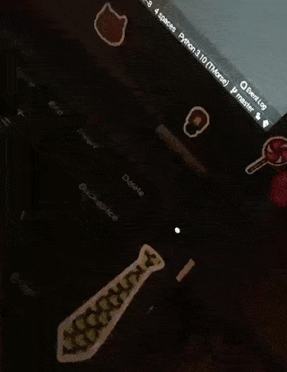
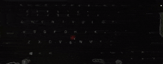
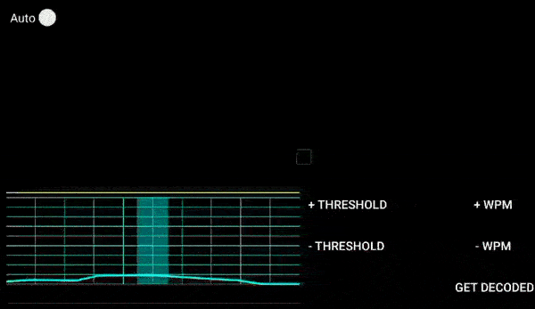

# TMorse

Run this code to blink your ThinkPad LED with a hidden mysterious Morse code! ;)\
Compatible with python3.9+. No third-party library is required, implemented in pure python.\
Make sure that you have required permissions to write to led acpi file descriptor.

# Take a look





## Installation

Installation of tmorse is a little complicated due to need of superuser access.\
Recommended way is using [pipx](https://github.com/pypa/pipx).
First, install pipx:

```bash
sudo apt install pipx
```

Then install tmorse by using command below:

```bash
sudo -E env "PATH=$PATH" pipx install --python python3.9 tmorse
```

P.S: TMorse is supported by python3.9+.

## Usage

```bash
sudo tmorse
```
→ Insert input manually, and it will blink your LED, which its location is defined by default to be `/proc/acpi/ibm/led`.

```bash
echo "This is a test" | sudo tmorse --stdin
```
→ Read the data from standard input.
```bash
sudo tmorse -c custom_codes.json
```
→  Encode characters to Morse based on your custom codes, although you should follow the protocol. (e.g. {"م": "--"})
```bash
sudo tmorse --on-command 2 --off-command 0 -l "/proc/acpi/ibm/kbdlight" -m 0.7 --default-led-status OFF
```
→ Show the Morse code by keyboard's backlit blinking.

- check `sudo tmorse --help` for more info.


## Contributing
    Written by: Mahyar Mahdavi <Mahyar@Mahyar24.com>.
    License: GNU GPLv3.
    Source Code: <https://github.com/mahyar24/TMorse>.
    PyPI: <https://pypi.org/project/TMorse/>.
    Reporting Bugs and PRs are welcomed. :)

## Inspired by 
This Project is based and inspired by "[Ritvars Timermanis](https://ritvars.lv/)" thinkmorse.
Take a look at: [thinkmorse](https://github.com/RichusX/thinkmorse).

## License
[GPLv3](https://choosealicense.com/licenses/gpl-3.0)
